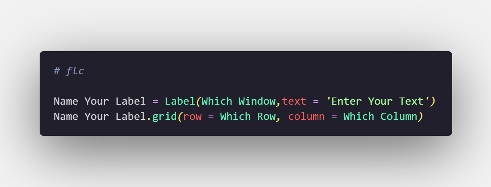
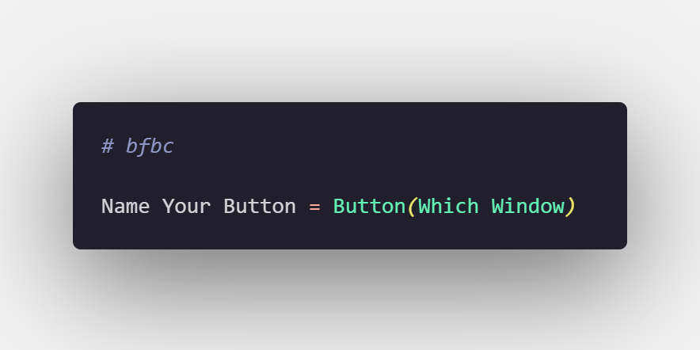
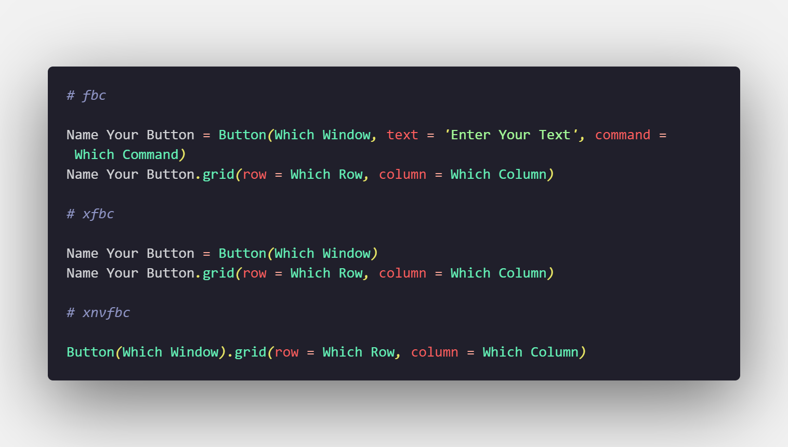
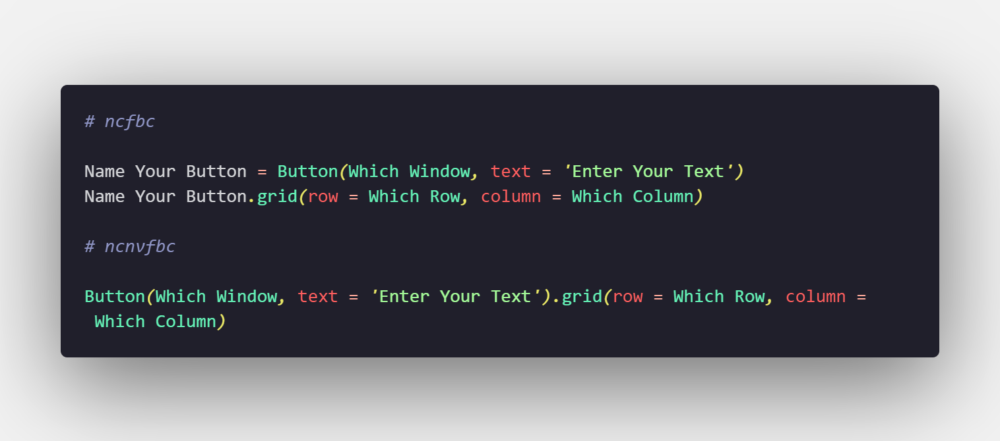

# Features

This extension adds tkinter snippets to VS Code.

New snippets are added with each version.

For list of snippets look at the bottom of the page.

# Usage

To use these snippets simply type a snippet into your editor and press tab. There will be fields you have to fill out, such as position, text etc. To fill this info out simply start typing. Once you fill in a field press tab to move on to the next field.

# Snippet types

## Regular snippets

Lets you type in the name of the variable for your element, as well as some basic info usually used with the element.

### Example:

## No variable snippets

prefix: **nv** 

If you put nv before the regular snippet, you get an element without a variable. These are not always recommended however they are useful sometimes.

### Example:

## Basic snippets

prefix: **b**

If you put b before the regular snippet, you get an element with only the prompt for a variable name and window selection.

### Example:

## X snippets

prefix: **x**

If you put x before the regulart snippet or the nv snippet, you get an element with only an attribute for setting the window and the grid positioning. X snippets are not available for all elements.

### Example:

## No command snippets

prefix: **nc**

If you put nc before a regular or a nv snippet, you get an element without a command attribute. This prefix can only be used for some elements (example: buttons).

### Example:

# List of snippets

## Regular snippets

**ftc** - creates a new tkinter window

**flc** - creates a new label

**fec** - creates a new entry

**fbc** - creates a new button

**fcbc** - creates a new checkbutton

**frbc** - creates a new radiobutton

## nv snippets *(no variable)*

**nvflc** - creates a new label without using a variable

**nvfec** - creates a new entry without using a variable

**nvfbc** - creates a new button without using a variable

**nvfcbc** - creates a new checkbutton without a variable (variable atribute is still in the definition of the checkbutton)

**nvfrbc** - creates a new radiobutton without a variable (variable atribute is still in the definition of the radiobutton)

## b snippets *(basic)*

**bftc** - creates a new basic tkinter window

**bflc** - creates a new basic label

**bfec** - creates a new basic entry

**bfbc** - creates a new basic button

**bfcbc** - creates a new basic checkbutton

**bfrbc** - creates a new basic radiobutton

## x snippets

**xflc** - creates a new x label

**xfbc** - creates a new x button

**xnvflc** - creates a new no variable x label

**xnvfbc** - creates a new no variable x button

**xfcbc** - creates a new x checkbutton

**xnvfcbc** - creates a new no variable x checkbutton

**xfrbc** - creates a new x radiobutton

**xnvfrbc** - creates a new no variable x radiobutton

## nc snippets

**ncfbc** - creates a button without a command attribute

**ncnvfbc** - creates a button without a command attribute and without a variable

## Other snippets

**tki** - from tkinter import *